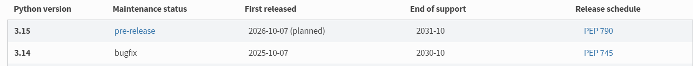

# Infrastructure Docker Multi-Réseaux

## 📋 Description

Infrastructure Docker avec 3 services sur 2 réseaux distincts :
- **db** : Base de données MariaDB
- **app** : Application Flask qui interroge la base
- **proxy** : Reverse proxy Nginx (point d'entrée)

## 🏗️ Architecture

```
  Hôte (localhost:8080)
         │
         ↓
    ┌─────────┐
    │  proxy  │ ← Seul accessible depuis l'hôte
    └─────────┘
         │
         ↓
    ┌─────────┐      ┌──────────┐
    │   app   │ ───→ │    db    │
    └─────────┘      └──────────┘
    
    backend_net (isolé)
```

**Réseaux** :
- `backend_net` : app + db (isolé)
- `frontend_net` : proxy (exposé)
- Le proxy fait le pont entre les deux

## Images docker utilisés

### Base de donnée Mariadb (`mariadb:latest`)
- Image maintenue et sécurisé
- Open source

### Application Flask (Build custom)
- Base `python:3.14-slim` (légère)
- Installation minimale : `flask` + `pymysql`
- Base + légère qu'une image python classique (42.81Mb vs 402.59Mb pour l'image `python:3.14.0`)
- Build + léger que l'image `python:3.14.0`


### Proxy Nginx (`nginx:alpine`)
- Image légère (~20.77MB) comparé à `nginx:latest` (57.21 MB)
- Configuration montée en volume (lecture seule)

## 🚀 Déploiement (racine du projet)

```bash
# Démarrer
docker compose up -d

# Vérifier
docker compose ps

# Arrêter
docker compose down

# Arrête et supprime conteneurs, networks et volumes
docker compose down -v
```
Lors de la commande pour démarrer le projet, utiliser la commande pour vérifier qu'il y ait bien les 3 containers  fonctionnels (Voir la section bonus **ma sortie**).

## ✅ Tests

### Test 1 : Accès à l'app
```bash
http://localhost:8080
```
Résultat : `Hello from app!`

### Test 2 : Connexion à la base
```bash
http://localhost:8080/health
```
Résultat : `{"db":"reachable","status":"ok"}`

## 🎁 Bonus

**Objectif** : La base de données ne doit **PAS** être accessible directement depuis l'hôte, et l'app doit être joignable via le proxy.

### Vérification des ports exposés

```bash
docker compose ps
```

**Ma sortie** :
```
NAME                  IMAGE            PORTS
tp-networks-app-1     tp-networks-app  5000/tcp
tp-networks-db-1      mariadb:latest   3306/tcp
tp-networks-proxy-1   nginx:alpine     0.0.0.0:8080->80/tcp
```

**Analyse** :
- ✅ `db` : `3306/tcp` → Pas de `0.0.0.0:3306`, donc **non accessible depuis l'hôte**
- ✅ `proxy` : `0.0.0.0:8080->80/tcp` → **Seul point d'entrée**

### Conclusion

- ❌ Impossible d'accéder à la DB directement depuis l'hôte
- ✅ L'accès fonctionne uniquement via : **Hôte → Proxy → App → DB**

## ⚠️ Problème Rencontré : Configuration Nginx

### Erreur initiale

J'avais la config par défaut du TP :
```nginx
server {
    listen 80;
    server_name _;
    location / {
        proxy_pass http://app:5000;
    }
}
```
Mais avec l'image `nginx:alpine`, j'ai rencontré ces 2 erreurs :

**Erreur** : `nginx: [emerg] "server" directive is not allowed here`


**Erreur** : `nginx: [emerg] no "events" section in configuration`

### Solution

L'image `nginx:alpine` nécessite **obligatoirement** les blocs `events {}` et `http {}` :

```nginx
events {
    # Obligatoire même si vide afin que ça utilise les paramètres par défaut
}

http {
    server {
        listen 80;
        server_name _;
        location / {
            proxy_pass http://app:5000;
            proxy_set_header Host $host;
            proxy_set_header X-Real-IP $remote_addr;
        }
    }
}
```

## 🧠 Raisonnement réalisation du projet

En ce qui concerne le Dockerfile, l'idée était donc de créer une image qui puisse contenir une application python, avec Flask et pymysql pour pouvoir interagir avec la base de donnée. 

La première étape a donc été de me rendre sur le docker hub pour trouver une image python. Je suis parti sur l'image `python:3.14-slim`, qui est la dernière version stable en date a être sortie. 



La version 3.15 est accessible mais étant une version de `pre-release`, je suis partie sur une base stable.

Ensuite, il a fallu me renseigner comment installer les dépendances Flask et pymysql.

Enfin, il restait plus qu'à copier le fichier `app.py` dans le container et à exposer le port 5000 (vérifiable dans le fichier `app.py`), qui est le port de Flask par défaut pour le développement. 

A partir de là, il ne me restait plus qu'à travailler sur le `compose.yml`. La première étape à faire a été de définir le squelette du fichier à partir des informations de l'exercice. On sait à partir de l'énoncé qu'on a 3 services à mettre en place, soit 3 containeurs nommé respectivement `db`, `app` et `proxy`. 

J'ai également défini les 2 networks nécessaire pour l'exercice `frontend_net`, accessible uniquement par nginx et `backend_net`, accessible par les services `db` et `app`, avec l'aide du service `proxy` qui fait le lien entre les deux networks.

Sachant qu'on utilise une app avec une database, j'ai ensuite défini les variables d'environnements pour les credentials de la base de donnée pour les services `db` et `app`, credentials qu'on retrouve dans le fichier `app.py`.

J'ai ajouté aussi des `depends_on` pour assurer l'ordre de démarrage des containers de la façon suivante : `db -> app -> proxy` afin que lorsque le reverse proxy est en place, le service soit opérationnel (si aucune erreur n'est rencontrée).

Enfin, j'ai finaliser le fichier avec l'ajout des volumes pour assurer la persistance des données pour la base de donnée `db` et de la configuration de nginx.

## Accès Image Docker Hub

[Docker Hub TP Networking](https://hub.docker.com/repository/docker/laharls/tp-networking/general)
